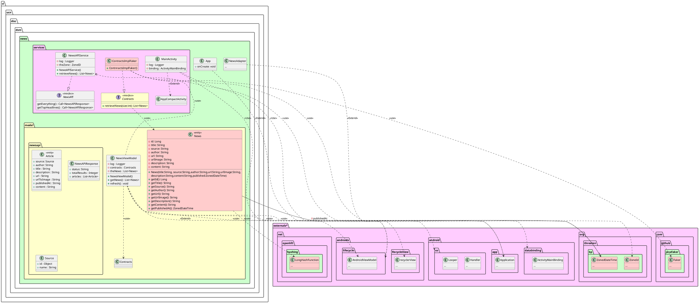

# The news Project

Android Project to show a list of News in the cellphone App

## Class Model

```puml
@startuml
package externals* #ffccff{
    package org.threeten.bp #ccffcc{
        class ZonedDateTime #ffcccc{
            ...
        }
        class ZoneId #ffcccc{
            ...
        }
    }
    package net.openhft.hashing #ccffcc{
        class LongHashFunction #ffcccc{
            ...
        }
}
package com.github.javafaker #ccffcc{
    class Faker #ffcccc{
        ...
    }
}
package androidx{
 package lifecycle {
    class AndroidViewModel{
    ...
    }
}
package RecycleView{
    class recyclerView{
    ...
    }
}
}
package android{
    package app{
        class Application{
               ...
        }
    }
    package os{
        class Handler{
        ...
        }
        class Looper{
        ...
        }
        
    }
    package databinding{
        class ActivityMainBinding{
        ...
        }
    }
   
}
}
package cl.ucn.disc.dsm.news #ccffcc {

    class App{
        + onCreate: void
    }
    App ..> Application : <<Extend>>
    
    class NewsAdapter{
        ...
    }
    NewsAdapter ..> recyclerView : <<Extend>> 
    
    package model #ffffcc {
        package newsapi{ 
            class Article <<entity>> {
                + source: Source
                + author: String
                + title : String
                + description : String
                + url : String 
                + urlToImage : String
                + publishedAt : String
                + content : String
            }
            class NewsAPiResponse{
                + status: String
                + totalResults : Integer
                + articles : List<Article>
            }
            class Source{
            + id : Object
            + name : String
            }
        }
        class News <<entity>> #ffcccc{
                - id: Long
                - title: String
                - source: String
                - author: String
                - url: String
                - urlImage: String
                - description: String
                - content: String
                + News(title:String, source:String,author:String,url:String,urlImage:String,
                description:String,content:String,published:ZonedDateTime)
                + getId(): Long
                + getTitle(): String
                + getSource(): String
                + getAuthor(): String
                + getUrl(): String
                + getUrlImage(): String
                + getDescription(): String
                + getContent(): String
                + getPublishedAt(): ZonedDateTime
            }
             News --> "1" ZonedDateTime: - publishedAt
             News ..> LongHashFunction : <<use>>
        class NewsViewModel{
                   - log : Logger
                   - contracts : Contracts
                   - theNews : List<News>
                   + NewsViewModel()
                   + getNews() : List<News>
                   + refresh() : void
        }
        NewsViewModel ..> Application : <<use>>
        NewsViewModel ..> os : <<use>>
        NewsViewModel ..> lifecycle : <<use>>
        
        NewsViewModel ..> Contracts : <<use>>
        
        NewsViewModel  ..> AndroidViewModel : <<Extend>>
        
       
    }
     package services #ffccff{
     
        interface Contracts <<interface>> #ffffcc{
            + retrieveNews(size:int): List<News>
        }
        Contracts ..> News: <<use>>
        
        class ContractsImplFaker #ffcccc{
            + ContnractsImplFaker()
            
        }
        
        ContractsImplFaker ..|> Contracts
        ContractsImplFaker ..> ZonedDateTime: <<use>>
        ContractsImplFaker ..> ZoneId: <<use>>
        ContractsImplFaker ..> Faker : <<use>>
        
        interface NewsAPI <<interface>>{
            getEverything() : Call<NewsAPIResponse>
            getTopHeadlines() : Call<NewsAPIResponse>
        }
        
         class NewsAPIService{
           - log : Logger
           - theZone : ZoneID
           + NewsAPIService()
           + retrieveNews() : List<News>
           
        }
        NewsAPIService ..|> NewsAPI
        NewsViewModel ..> NewsAPIService : <<use>>
        class MainActivity {
            - log : Logger
            - binding : ActivityMainBinding
        }
        MainActivity ..> AppCompactActivity : <<Extend>>
        MainActivity ..> databinding : <<Use>>
        MainActivity ..> lifecycle : <<Use>>
        
        
       
    }
    
    
}

@enduml
```

## license

[MIT](https://choosealicense/mit/)
