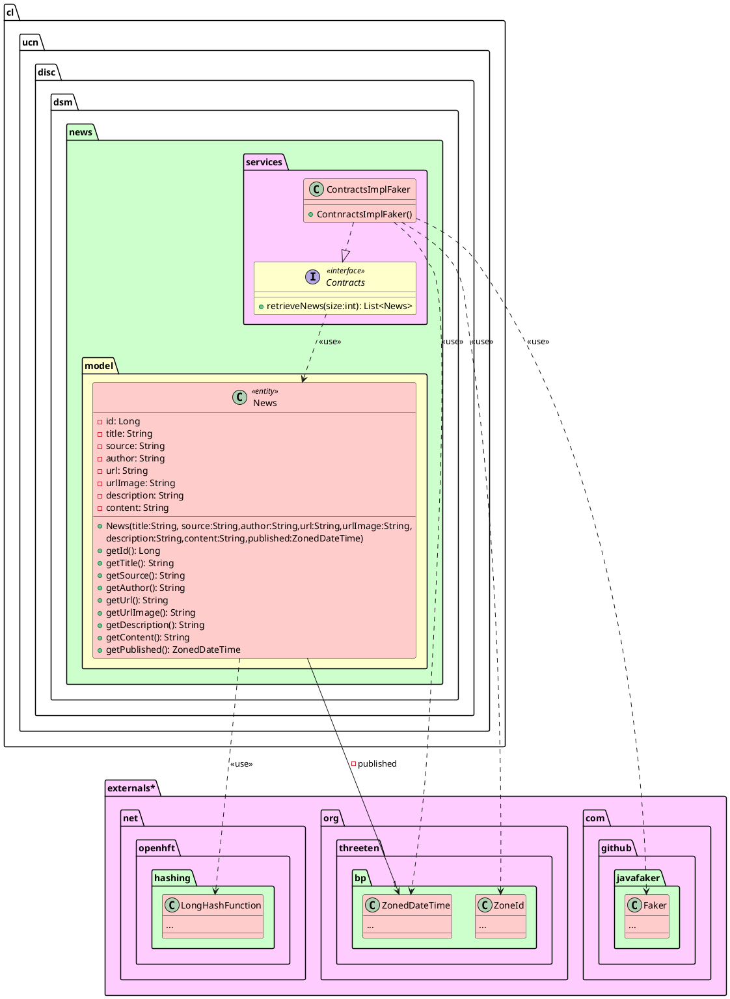

# The news Project

Android Project to show a list of News

## Class Model

```puml
@startuml
package externals* #ffccff{
    package org.threeten.bp #ccffcc{
        class ZonedDateTime #ffcccc{
            ...
        }
        class ZoneId #ffcccc{
            ...
        }
    }
    package net.openhft.hashing #ccffcc{
        class LongHashFunction #ffcccc{
            ...
        }
}
package com.github.javafaker #ccffcc{
    class Faker #ffcccc{
        ...
    }
}
}
package cl.ucn.disc.dsm.news #ccffcc {

    
    package model #ffffcc {
    
        class News <<entity>> #ffcccc{
            - id: Long
            - title: String
            - source: String
            - author: String
            - url: String
            - urlImage: String
            - description: String
            - content: String
            +News(title:String, source:String,author:String,url:String,urlImage:String,
            description:String,content:String,published:ZonedDateTime)
            + getId(): Long
            + getTitle(): String
            + getSource(): String
            + getAuthor(): String
            + getUrl(): String
            + getUrlImage(): String
            + getDescription(): String
            + getContent(): String
            + getPublished(): ZonedDateTime
        }
        News --> "1" ZonedDateTime: - published
        News ..> LongHashFunction : <<use>>
    }
     package services #ffccff{
        interface Contracts <<interface>> #ffffcc{
            + retrieveNews(size:int): List<News>
        }
        Contracts ..> News: <<use>>
        
        class ContractsImplFaker #ffcccc{
            + ContnractsImplFaker()
            
        }
        ContractsImplFaker ..|> Contracts
        ContractsImplFaker ..> ZonedDateTime: <<use>>
        ContractsImplFaker ..> ZoneId: <<use>>
        ContractsImplFaker ..> Faker : <<use>>
    }
    
    
}

@enduml
```

## license

[MIT](https://choosealicense/mit/)